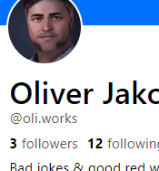

# Bluesky mit eigener Domain

Bei [Bluesky](https://bsky.app/), der neueren Twitter-Alternative, gibt es standardmäßig Benutzerhandles im Stil von `@deinbenutzername.bsky.social`. Das sieht auf den ersten Blick etwas gewöhnungsbedürftig aus, vor allem im Vergleich zu Twitter (`deinbenutzername`). Tatsächlich handelt es sich beim Bluesky-Handle aber um einen Domainnamen, genauer: um eine Subdomain von `bsky.social`.

Bluesky bietet jetzt seit einiger Zeit die Möglichkeit, den Standard-Handle durch eine ^^eigene^^ Domain zu ersetzen. Voraussetzung dafür ist natürlich, dass man eine eigene Domain besitzt und Zugriff auf die Nameserver-Einträge hat (alternativ kann man eine spezielle Textdatei auf seinen Webserver hochladen).

Ich habe meinen Bluesky-Handle auf **oli.works** gesetzt:

Dokumentiert ist der Ablauf bei Bluesky (s.u.). In kurz:

- Settings > Advanced > Change handle > I have my own domain
- die Domain eingeben - es wird angezeigt, welche Verifikationsinfo für die Domain hinterlegt werden muss
- im Nameserver für diese Domain einen `TXT´-Eintrag für `_atproto` anlegen mit dem oben angezeigten Verifikationswert
- kurz warten, auf *Verify DNS Record* klicken, fertig.

## Dokumentation

[How to set your domain as your handle - Bluesky](https://blueskyweb.xyz/blog/4-28-2023-domain-handle-tutorial)
