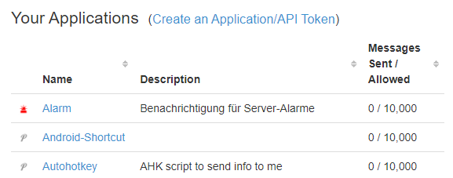
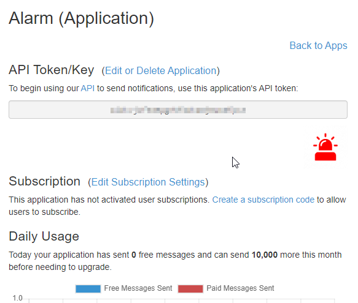

# Einfache Push-Benachrichtigungen mit Pushover

*Pushover* ist ein Webdienst, der über eine einfache Schnittstelle (*API*) die unkomplizierte Benachrichtigung mittels Push-Nachrichten auf Mobilgeräte ermöglicht.

## Preis

Der Dienst ist für Privat- und Einzelnutzer günstig: für jedes Endgerät wird nur [eine einmalige Zahlung von 5 USD](https://pushover.net/pricing) verlangt.

Es gibt noch einen größeren Tarif namens [Pushover for Teams](https://pushover.net/teams). Dieser kostet 5 USD pro Nutzer und Monat. Hier sind größere Nachrichtenlimits verfügbar und zentrale Verwaltungs- und Logging-Funktionen eingebaut.

Für die meisten Fälle dürfte jedoch der "kleine Preis" mit Einmalzahlung ausreichen.

## Grundsätzliches Vorgehen

- Konto anmelden
- Client installieren und im Konto registrieren
- Absendeadresse (*Application*) definieren
- über die API eine Nachricht senden

## Applications, die Absendeadressen

Jedes Nutzerkonto hat einen sog. *User Key*. Dieser könnte so aussehen: `qpnx2xgcpwwftfia574mgk3y6424e3`. Das ist die Adresse, **an** die eine Push-Nachricht gesendet wird. Die zu diesem Konto registrierten Endgeräte empfangen dann die Nachricht und zeigen diese an.

In einem Nutzerkonto können mehrere Absender definiert werden (genannt *Applications*). Es macht Sinn, z.B. für jeden Server oder für verschiedene Programme, die Push-Nachrichten absetzen sollen, jeweils einen eigenen Absender anzulegen.

Jeder Absender hat einen Namen, kann ein eigenes Logo bekommen (das beim Empfang einer Push-Nachricht auf dem Endgerät angezeigt wird) und hat sein eigenes monatliches Nachrichtenlimit.

Eine Application hat eine Kennung (den sog. *API Token*). Auch hier handelt es sich wie beim *User Key* um einen 30-stelligen alphanumerischen Schlüssel.

## API

Pushover bietet eine ganz einfache [API](/api/) an. Der eigene Dienst (z.B. ein Server) schickt einen HTTP-POST-Request an einen Endpunkt mit einigen wenigen Daten:

- `token` - das ist der API-Token der Application (der Absender)
- `user` - das ist der User-Token des eigenen Kontos (der Empfänger)
- `message` - die zu versendende Nachricht
- `title` - einen vorangestellten Titel (optional)
- `device` - der Name eines registrierten Endgeräts, wenn man nicht auf allen Endgeräten diese Nachricht empfangen möchten (optional)

Weitere mögliche **optionale** Datenfelder sind:

- `priority`
- `device`
- `sound`
- `attachment`

Der Endpunkt lautet: `https://api.pushover.net/1/messages.json`

## Weitere Versandmöglichkeiten

Zusätzlich zum direkten Ansprechen der API gibt es viele Dienste, die die Integration der Pushover-API bereits von Haus aus mitbringen (z.B. IFTTT).

Eine alternative Möglichkeit ist das Anlegen von E-Mail-Adressen. Für jede Adresse kann einzeln definiert werden, an welche Endgeräte und mit welcher Priorität die Nachricht ausgeliefert werden soll. So lassen sich auch Workflows integrieren, die zwar Status-E-Mails versenden können, aber keine Skripte/Webaufrufe absetzen können. Oder man kann im eigenen E-Mail-Konto eine Regel einrichten, die besonders wichtige E-Mails an diese Pushover-E-Mail-Adresse weiterleitet.

## Verwendungsmöglichkeiten

Ich verwende Pushover-Benachrichtigungen immer dann, wenn ich mich von Servern/Diensten/Abläufen/Programmen über Probleme oder unregelmäßige Schritte bzw. Schritte mit unklarer Dauer benachrichtigen lassen möchte.

Beispielsweise sendet mir die [Github-Action](/misc/github-actions/), die [nach dem Verfassen neuer Beiträge](/info/#zur-technik-dieser-website) zu dieser Website von [Github](/misc/github/) automatisch ausgeführt wird, am Ende einen kurzen Statusbericht per Pushover. So weiß ich, dass die neue Version dieser Website online ist.

Eine weitere Möglichkeit sind lang laufende Datenbank-Jobs (im Rahmen einer Datenbank-Wartung). Hier weiß ich im Vorfeld nicht, wie lange diese laufen werden. Damit ich aber nach Abschluss eines solches Jobs kurzfristig wieder auf den Server schauen kann, lasse ich mich benachrichtigen.

## User und Token

Noch ein Hinweis zum Zusammenhang von eigenen Pushover-Konto (*User-Key*) und der absendenden Application (*API-Token*):

Oben habe ich dargestellt, dass man **immer** von *eigenen* Applications **zum** *eigenen* Empfänger sendet. Das dürfte auch der Normalfall sein. Es ist jedoch problemlos möglich, eine Nachricht auch an den einen *anderen* Benutzer zu senden. Dafür benötigt man lediglich den User-Key dieses Benutzers.

## Informationen

- [Pushover-Website](https://pushover.net)
- [Informationen zur API](https://pushover.net/api)

{{ feedback(page.meta.title, page.meta.section, page.meta.slug) }}
