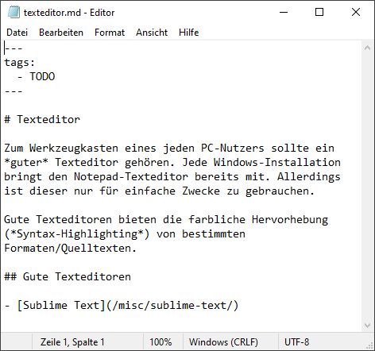
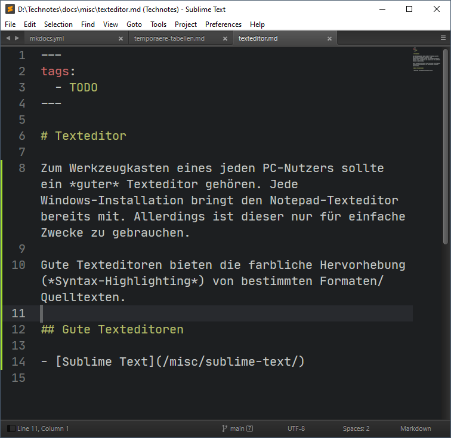

# Texteditor

Zum Werkzeugkasten eines jeden PC-Nutzers sollte ein *guter* Texteditor gehören. Jede Windows-Installation bringt den Notepad-Texteditor bereits mit. Allerdings ist dieser nur für einfache Zwecke zu gebrauchen.

Gute Texteditoren bieten die farbliche Hervorhebung (*Syntax-Highlighting*) von bestimmten Formaten/Quelltexten.

## Gute Texteditoren

- [Sublime Text](/misc/sublime-text/)

## Beispiel Syntax-Hightlighting

Am Beispiel des Quelltextes dieser Seite hier sieht man den Unterschied zwischen dem Notepad (keine Hervorhebung) und [Sublime Text](/misc/sublime-text/).

{{ feedback(page.meta.title, page.meta.section, page.meta.slug) }}
