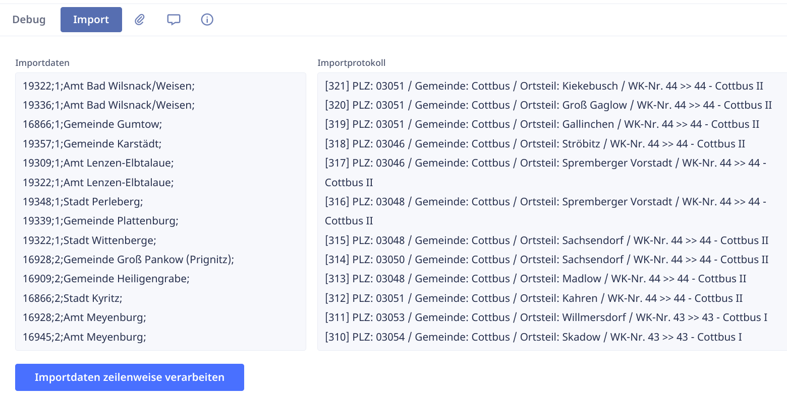

# Benutzerdefinierter CSV-Import

## Hintergrund

Es gibt in Ninox die Möglichkeit, auf jeder Tabelle einen CSV-Import auszuführen. Das funktioniert gut bei *einfachen* Tabellen - wenn es sich bei den Feldern der Tabelle um Felder handelt, die direkte Dateninhalte speichern (z.B. Texte, Zahlen, Datum).

Sobald man jedoch Tabellen-Verknüpfungen hat muss man beim Import anhand eines Klartextschlüssels (aus der CSV-Datei) den Datensatz, <u>auf den die Verknüpfung verweist</u>, *irgendwie* ermitteln und dann speichern.

## Umsetzung

Ich lege dazu gerne eine Hilfstabelle an (mit Namen *Debug*, *Tools*, o.ä.), die ich zu einem späteren Zeitpunkt dann ausblende.

In dieser Tabelle bzw. dem dazugehörigen Formular lege ich in der Regel dann ein Feld für die Importdaten an, ein Feld für Protokollausgaben und einen [Button für das Skript](../skripting/).



Der CSV-Inhalt kann aus der CSV-Datei direkt in das Feld Importdaten kopiert werden.

### Beispiel

Im konkreten Beispiel ging es um eine Datenbank, die eine Tabelle mit Landtagswahlkreisen hatte. Zu jedem Landtagswahlkreis sollten jetzt in einer Detailtabelle (*Komposition*) die entsprechenden Postleitzahlen sowie Gemeinde- und Ortsteilnamen angelegt werden.

Es stand eine Importdatei mit diesen vier Werten zur Verfügung:

- PLZ
- Gemeindename
- Ortsteilname
- Nummer des Wahlkreises 

**Das Skript muss** nun für jede Zeile der CSV-Datei einen Datensatz in der PLZ-Tabelle anlegen, dann anhand der Wahlkreis-Nummer in der Wahlkreis-Tabelle den entsprechenden Datensatz finden und diesen Verweis ebenfalls in den PLZ-Datensatz schreiben, um die Verknüpfung zwischen PLZ und Wahlkreis herzustellen.


### Skript

So sieht das fertige Skript aus:

```javascript linenums="1"
do as transaction
  let i := 0;
  let prot := "";
  Importprotokoll := null;
  let zeilen := splitx(Importdaten, "\n");
  for zeile in zeilen do
    i := i + 1;
    zeile := trim(zeile);
    let parts := split(zeile, ";");
    let ltwk := first(select Landtagswahlkreise where 'Wahlkreis-Nr' = item(parts, 1));
    prot := "[" + i + "] PLZ: " + item(parts, 0) + " / Gemeinde: " + item(parts, 2) + " / Ortsteil: " + item(parts, 3) + " / WK-Nr. " + item(parts, 1) + " >> " + ltwk.'Wahlkreis-Nr' + " - " + ltwk.'Wahlkreis-Name';
    let rec := (create 'Landtagswahlkreise-PLZ');
    rec.(PLZ := item(parts, 0));
    rec.(Gemeindename := item(parts, 2));
    rec.(Ortsteilname := item(parts, 3));
    rec.(Landtagswahlkreise := number(ltwk));
    Importprotokoll := prot + NL() + Importprotokoll
  end
end
```

Da hier viele Datensätze verarbeitet werden müssen, empfiehlt es sich, das in einer Transaktion (die automatisch auf dem Server durchgeführt wird) zu machen (Zeile 1).

Ich verwende gerne eine Zählvariable, einfach nur um im Protokoll eine ungefähre Orientierung über den Fortschritt zu haben (Zeilen 2 und 7).

Im Debug-Formular (auf dem dieser Button liegt) gibt es ein Textfeld namens *Importprotokoll*. In dieses wird "live" für jeden verarbeiteten Datensatz eine Protokollzeile geschrieben. Dazu wird eine leere Variable für den einzelnen Protokolleintrag angelegt. Anschließend wird das Protokoll-Textfeld geleert, falls es durch einen vorherigen Testlauf befüllt war (Zeilen 3 und 4).

Der Inhalt des Importdaten-Textfelds (der ein einziger, großer String ist) wird mit Hilfe der Ninox-Funktion `splitx` in einzelne Zeilen getrennt. Das Resultat ist ein *Array* mit dem Namen *zeilen* (Zeile 5).

Anschließend geht das Skript in einer Schleife einzeln über alle Zeilen (Zeile 6). Es wird die o.g. Zählvariable hochgezählt (Zeile 7). Sicherheitshalber wird die jeweilige Zeile *getrimmt*, um überflüssige Leerzeichen am Anfang oder Ende zu entfernen (Zeile 8).

In diesem Beispiel hat die CSV-Datei ein Semikolon als Feld-Trennzeichen. Anhand dieses Trennzeichens wird die aktuelle Zeile in einzelne Felder aufgesplittet (Zeile 9). Auch dieser Split gibt wieder ein Array zurück (hier *parts* genannt).

Im CSV-Import in der zweiten Spalte befindet sich die Nummer des Wahlkreises. Da Arrays immer 0-indiziert sind, steht jetzt die Wahlkreis-Nummer im Feld `parts[1]` (Hinweis: Ninox verwendet für den Zugriff auf Array-Elemente die Funktion `item(Arrayname, Feldnummer)`).

Jetzt wird aus der Wahlkreis-Tabelle anhand der Wahlkreis-Nummer der entsprechende Wahlkreis ausgelesen (Zeile 10). Da ein `select` in Ninox immer mehrere Datensätze zurückgibt, erzwingt man mit `first` die Rückgabe als einzelnen Datensatz - dieser steht nun in der Variable `ltwk`.

In Zeile 11 wird jetzt der aktuelle Protokolleintrag zusammengebaut.

Im nächsten Schritt wird der neue PLZ-Datensatz angelegt (Zeile 12) und danach mit den aus dem CSV-Import bekannten Klartextfeldern PLZ, Gemeindename und Ortsteilname befüllt (Zeilen 13-15).

Die PLZ-Tabelle hat - wie oben beschrieben - eine Verknüpfung zur Wahlkreis-Tabelle. Diese Verknüpfung wird gesetzt, indem man den in Zeile 10 ermittelten Wahlkreis-Datensatz hineinschreibt (Zeile 16). **Achtung**: der Datensatz wird mit der Funktion `number` umgewandelt. Angewandt auf einen Datensatz (*record* in Ninox) gibt die `number`-Funktion die eindeutige Datensatz-Nummer (den *Primärschlüssel*) des Datensatzes zurück. Hier verhält sich die Ninox-Datenbank also analog zu einer relationalen Datenbank.

Anschließend wird der jeweils aktuelle Protokolleintrag in das Protokolltextfeld geschrieben. Dabei wird der neue Protokolleintrag immer vor den bisherigen Inhalt des Protokolltextfeldes gepackt, damit die neueren Einträge oben erscheinen (Zeile 17).

Abschließend wird nur noch die Schleife sowie die Transaktion beendet (Zeilen 18 und 19).

Das **Resultat dieses Skripts** ist, dass für jede Zeile aus dem CSV-Import ein PLZ-Datensatz angelegt worden und mit einem Wahlkreis-Datensatz verknüpft wurde.


{{ feedback(page.meta.title, page.meta.section, page.meta.slug) }}
