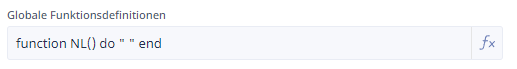
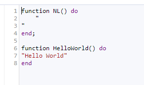

# Globale Funktionen

Ninox bietet die Möglichkeit, in einer Datenbank eine Bibliothek an globalen Funktionen anzulegen. Diese können dann aus alle anderen Skripten innerhalb der gleichen Datenbank aufgerufen werden.

## Globale Funktionen anlegen und bearbeiten

Dazu muss man in den "Arbeitsmodus" wechseln (Schraubenschlüssel-Button) - in der Titelleiste erscheinen dann zusätzliche Links:


Auf der Seite *Optionen* kann man die Bibliothek mit globalen Funktionen einsehen und pflegen:



Allerdings erfolgt die Pflege der globalen Funktionen in einem *einzigen* Editor-Fenster. Hier können nacheinander mehrere Funktionen hineingeschrieben werden. Ab einer gewissen Größe ist das dann nicht mehr unbedingt übersichtlich. Auch ist es nicht möglich, die globalen Funktionen irgendwie in *Namespaces* zu ordnen.



## Globale Funktion für Newline-Zeilenumbruch

Eine globale Funktion **NL** anlegen - diese liefert einen Zeilenumbruch z.B. beim manuellen Zusammenbau von CSV-Strings.

```javascript
function NL() do
  "
"
end
```


{{ feedback(page.meta.title, page.meta.section, page.meta.slug) }}
