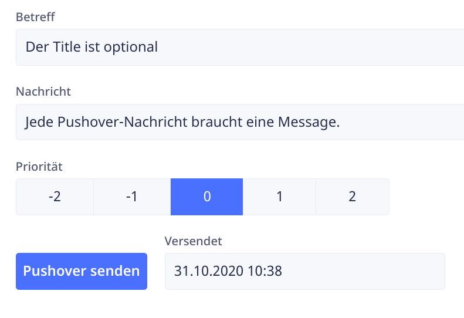

[Pushover](/misc/pushover/) ist ein leichtgewichtiger und kostengünstiger Benachrichtigungsdienst. Über Pushover können Sie schnell und einfach Push-Nachrichten aufs Mobiltelefon senden. Dies eignet sich beispielsweise für die Benachrichtigung bei Serverausfällen oder eiligen Kundenkontakten.

Selbstverständlich können Sie auch von Ihrer [Ninox-Datenbank](/ninox) aus Pushover-Nachrichten versenden. Ich zeige Ihnen hier, wie einfach das geht.



In meiner Beispieldatenbank habe ich eine Tabelle mit diesen Feldern angelegt:

- Betreff
- Nachricht
- Priorität
- ein Versendet-Zeitstempel

Hinter der Schaltfläche *Pushover senden* liegt ein Skript, das per HTTP-Aufruf die Pushover-API anspricht und die Nachricht versendet:

```javascript
let user_token := "derPushoverUserToken";
let app_token := "derPushoverApiToken";
let payload := {
        token: app_token,
        user: user_token,
        message: Nachricht,
        title: Betreff
    };
let response := http("POST", "https://api.pushover.net/1/messages.json", {
        'Content-Type': "application/json"
    }, payload);
if response.error then
    alert("Fehler beim Versenden!")
else
    Versendet := now()
end
```

Wenn die Nachricht erfolgreich versendet worden ist, wird in das Feld *Versendet* die aktuelle Zeit eingetragen. Zur Vereinfachung habe ich hier auf die Behandlung der Priorität verzichtet.


{{ feedback(page.meta.title, page.meta.section, page.meta.slug) }}
