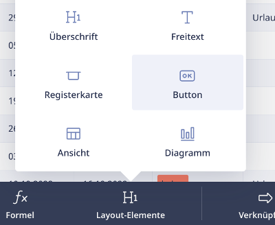
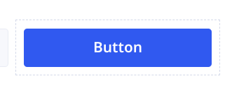
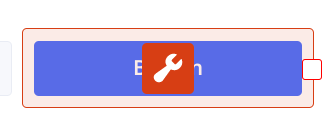
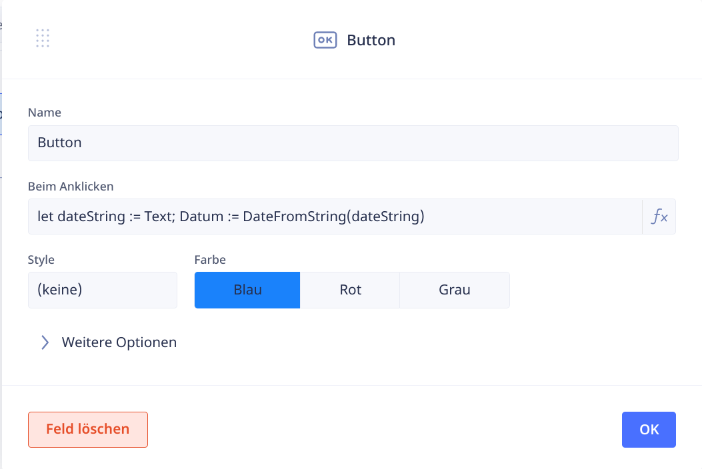
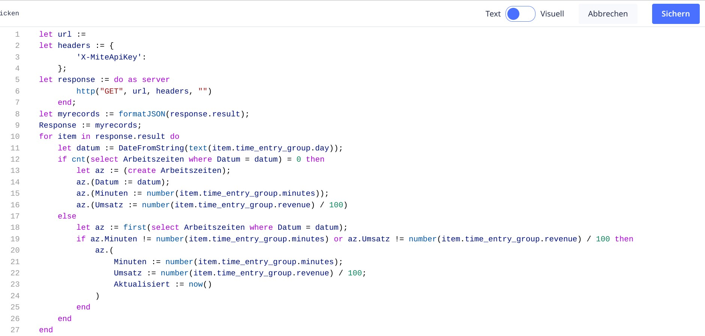

## Hintergrund

Zwar ist es möglich, in Ninox auch ohne Programmierung, mit rein grafischer Gestaltung von Tabellen und Formularen schon sehr weit zu kommen (*No-Code*). Sobald man allerdings etwas komplexere Strukturen oder vor allem auch Abläufe realisieren will, kommt man um die Nutzung von Ninox' eingebauter Skript-Programmiersprache nicht herum. Um einen aktuellen Begriff zu verwenden: Ninox ist eine *Low-Code*-Plattform: es ist möglich und auch sinnvoll, Skripte einzubauen. Diese dienen aber nur dazu, die bereits mit den visuellen Tools erzeugten Strukturen und Formulare zu verbinden.

## Generelles Vorgehen

Skripte werden oft genutzt und gestartet, indem man diese hinter einen [Button](./layout-elemente/) legt. Dazu muss man zuerst in den [Admin-Modus wechseln](./admin/). Danach kann man einen Button hinzufügen:

Im Admin-Modus sieht man außerhalb des blauen Button-Bereichs eine ganz leichte graue Linie. Wenn man mit der Maus in diesen Bereich *außerhalb* des Buttons, aber innerhalb der grauen Linie klickt, dann wird der gesamte Bereich hellrot hinterlegt und über dem Button erscheint ein rotes Symbol mit einem Schraubenschlüssel (das gleiche, das rechts oben anzeigt, dass man sich im Admin-Modus befindet).

Wenn man jetzt auf dieses rote Symbol klickt, dann öffnet sich der eigentliche Eigenschaften-Dialog für den Button.

Hier kann man den Titel (und damit gleichzeitig den Namen) des Buttons anpassen sowie verschiedene Einstellungen zur Optik (Farbe, Stil). Relevant ist allerdings der Bereich *Beim Anklicken*. Hierüber lässt sich das Skript pflegen, das beim Anklicken des Buttons ausgeführt werden soll. Bei einem kurzen Skript sieht man das gesamte Skript, bei einem längeren nur den Beginn in diesem Feld.

Klickt man auf die Zeile mit dem Skript, dann öffnet sich endlich der eigentliche **Skripteditor**.

{{ feedback(page.meta.title, page.meta.section, page.meta.slug) }}
