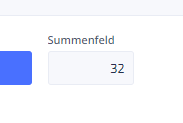

# Text in Ninox zeilenweise verarbeiten

Einen netten Workaround, den ich immer wieder gerne verwende:

Ein mehrzeiliges Textfeld, in das man zeilenweise Text (oder - wie hier im Beispiel - Zahlen) eingeben kann. Über einen Button wird der mehrzeilige Text dann zeilenweise verarbeitet.

## Beispiel "Taschenrechner"

Im konkreten Beispiel werden die *Zahlen* im Textfeld *aufsummiert*.

Dazu lege ich eine Tabelle mit einem mehrzeiligen Textfeld, einem Button und einem Zahlenfeld für die Summe an.


Das automatisch bereitgestellte Formular sieht dann so aus. Ich habe bereits Zahlen eingegeben.


Im Skriptbereich des Buttons *Summe berechnen* wird der unten gezeigte Code eingegeben. Nach einem Klick auf den Button erscheint im *Summenfeld* die korrekte Summe **32**.



## Quellcode

Das ist der notwendige Code. Der Inhalt des Textfeldes mit dem umständlichen Namen *Name des mehrzeiligen Textfeldes* wird in die Variable `text` eingelesen. Die Funktion `splitx` trennt diesen an den Zeilenumbrüchen und gibt ein Array `rows` zurück.

Es gibt eine mit 0 initialisierte Summenvariable. In einer Schleife wird über das Array mit den Zeilen iteriert und der Zahlenwert jeder Zeile zur Summenvariable hinzugerechnet.

Da jede Zeile mit `number(trim(row))` in eine Nummer umgewandelt wird, können hier auch problemlos Nicht-Zahlen stehen. Diese werden beim Summieren ignoriert.

Die fertige Summe wird abschließend in das Summenfeld geschrieben.

```javascript
let text := 'Name des mehrzeiligen Textfeldes';
let rows := splitx(text, "\n");
let summe := 0;
for row in rows do
    summe := summe + number(trim(row))
end;
Summenfeld := summe
```

## Nutzen

Das hier gezeigte Beispiel eines *Mini-Taschenrechners* hat nur Demonstrationscharakter.

Eine denkbare und von mir bereits praktisch umgesetzte Funktion ist der massenweise Import von Rechnungsdaten aus einer bestehenden Excel-Tabelle in eine Ninox-Datenbank. In der Excel-Tabelle habe ich die relevanten Spalten über eine Formel in einer Spalte zusammengeschrieben (getrennt durch ein Trennzeichen) und dann alle Zeilen dieser Spalte kopiert und in das Textfeld geschrieben. Der Schleifencode hat die einzelnen Zeilen dann anhand des Trennzeichens wieder aufgeteilt, geprüft, ob es die Rechnungsnummer bereits gibt und falls nein, die Rechnung neu angelegt.


{{ feedback(page.meta.title, page.meta.section, page.meta.slug) }}
