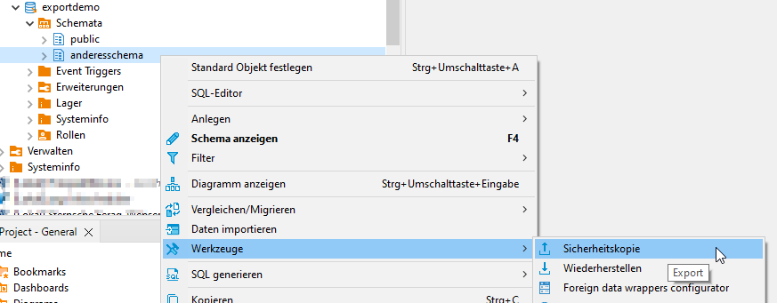
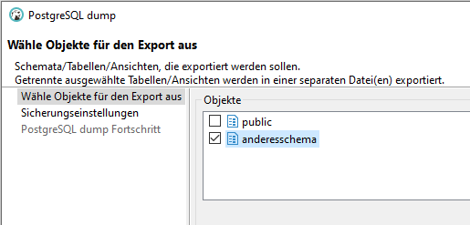
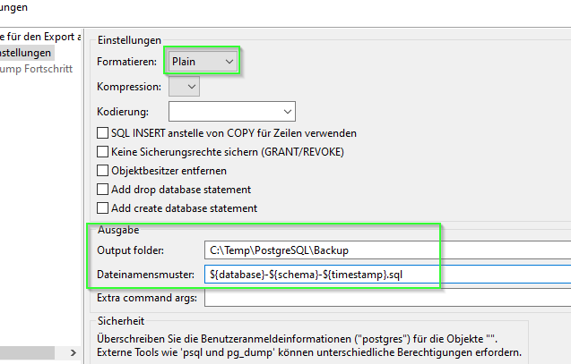
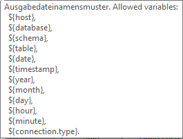
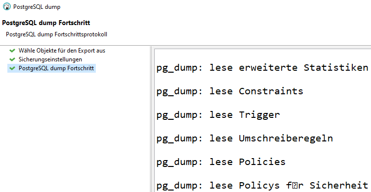
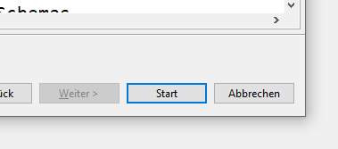
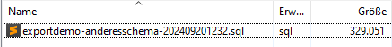
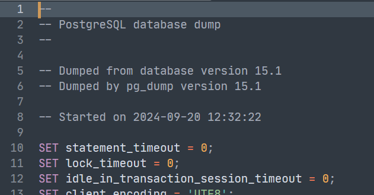

Für die Arbeit mit PostgreSQL-Datenbanken verwende ich im Regelfall die Admin-Software **DBeaver**.

## Format des Dumps

Es gibt zwei Dateiformate, in denen Daten aus einer PostgreSQL-Datenbank exportiert werden können:

* `plain`: Export in eine Klartextdatei, die die SQL-Statements enthält
* `custom`: Export in einem Binärformat speziell für PostgreSQL

Grundsätzlich gilt: der Binärexport ist kompakter und effizienter beim Wiedereinlesen. Er eignet sich damit vor allem für den Transfer großer Datenbanken oder Datenbestände. Der Export in eine Klartextdatei hingegen bietet sich an, wenn man nur Teile oder kleinere Datenbestände transportieren muss. Vielleicht möchte man sogar nach dem Export und vor dem Wiedereinspielen manuelle Anpassungen an Struktur oder Daten vornehmen - dafür kann man die SQL-Datei dann einfach mit einem [Texteditor](/misc/texteditor/) öffnen.

## Export eines Datenbank-Schemas

Über den Datenbankbaum kann man in der Datenbank das Schema auswählen, das man exportieren will. Im *Kontextmenü* gibt es im Untermenü *Werkzeuge* den Punkt *Sicherheitskopie* - dahinter verbergen sich die Funktionen zum Erzeugen eines Datenbank-Dumps.

Es öffnet sich ein Dialog, in dem man Einstellungen für den Dump vornehmen kann. Das im ersten Schritt gewählte Datenbank-Schema ist schon aktiviert, kann aber noch geändert werden.

Mit *Weiter* kommt man zu den weiteren Sicherungseinstellungen. Hier kann man das Exportformat (`plain` oder `custom`) auswählen. Ich habe mich hier für den Export in eine Klartextdatei entschieden. Das hat den Grund, dass ich aus dem Dump gezielt die Tabellenstruktur *einer* Tabelle herauskopieren möchte.

Im Bereich *Ausgabe* kann man das Verzeichnis und den Dateinamen angeben.

Praktisch sind die Platzhalter für Datei- und Verzeichnisnamensmuster. Folgende Platzhalter kann man in DBeaver verwenden (dieser Tooltip wird angezeigt, wenn man die Maus über die Felder *Verzeichnis* oder *Dateinamen* hält):

Mit *Start* beginnt der Export. Die einzelnen Schritte werden im Dialogfenster angezeigt.

!!! note ""
    Achtung! Am Ende des Exportvorgangs wird immer noch der Button *Start* angezeigt. Wenn man diesen erneut anklickt, erfolgt der Dump ein zweites Mal. Statt dessen muss man hier *Abbrechen* klicken, um den Dialog zu schließen.

Im gewählten Exportverzeichnis entsteht dann die Exportdatei. Weil als Exportformat `plain` gewählt wurde, lässt sich die Datei mit einem Texteditor anzeigen.

## Informationen

* [DBeaver (Community-Edition)](https://dbeaver.io/){target="_blank"}

{{ feedback(page.meta.title, page.meta.section, page.meta.slug) }}
