# Arbeiten mit Datenbank-Events in SQL Anywhere

SQL Anywhere bringt von Haus aus Datenbank-Ereignisse (englisch: *events*) mit. Diese Events lassen sich *zeitgesteuert* aufrufen (wie Cron-Jobs) oder anhand bestimmter Ereignisse *triggern*.

Für viele Anwendungsfälle ist es deshalb nicht mehr notwendig, Jobs von außen (Cronjob, Windows-Aufgabenplanung) anzustoßen. Statt dessen kann der Datenbank-Server selbstständig zu einem definierten Zeitpunkt Wartungsskripte o.ä. durchführen.

## Walkthrough

Nachfolgend beschreibe ich ausführlich, wie man ein Ereignis anlegt, einplant und prüfen kann, dass es gelaufen ist.

### Datenbank anlegen

Für diese Demonstration habe ich eine [neue Datenbank angelegt](../datenbank-anlegen/), [gestartet](../datenbank-starten/) und mich dann über den [SQL Central](../sql-central/) verbunden. Im Baum mit den Datenbank-Objekten findet man den Knoten *Ereignisse*. Dieser ist bei einer neuen Datenbank noch leer.


### Ereignis über den Assistenten anlegen

Über das Kontextmenü (*Neu > Ereignis...*) legen wir ein neues Ereignis an.

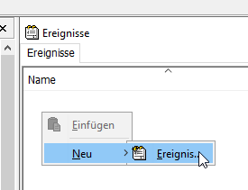

Es startet der *Assistent zum Erstellen von Ereignissen*. Wir geben dem Ereignis zuerst einen Namen.

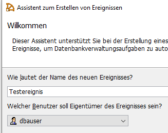

Als nächstes wird schon der *Trigger* definiert. Das ist die Einstellung, wodurch das Ereignis **ausgelöst** werden soll.


SQL Anywhere kennt drei Arten von Auslösern:

- manuell ausgelöst
- zeitlich geplant (*Cron-Job!*)
- durch ein Systemereignis bedingt

Fürs erste definieren wir einen zeitlich geplanten Auslöser. Der Assistent fragt nach einem Namen für den Zeitplan. Sich hierbei allzuviel Gedanken zu machen macht nur in Konstellationen Sinn, wenn man mehrere Zeitpläne für ein Ereignis definieren möchte.

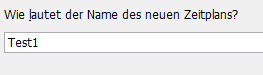

Hier definiere ich, dass das Ereignis um 14 Uhr starten soll.

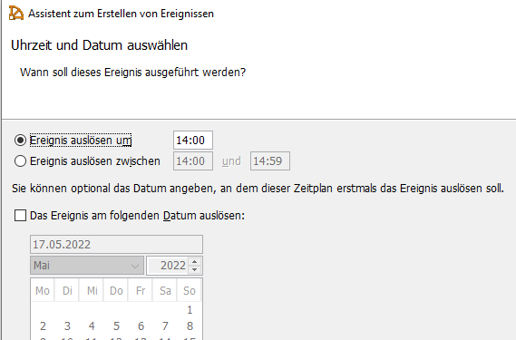

Im nächsten Schritt wird eingestellt, ob und wann sich das Ereignis *wiederholen* soll. Der so hinterlegte Auslöser führt also dazu, dass an allen Werktagen jeweils um 14 Uhr das Ereignis ausgelöst wird.

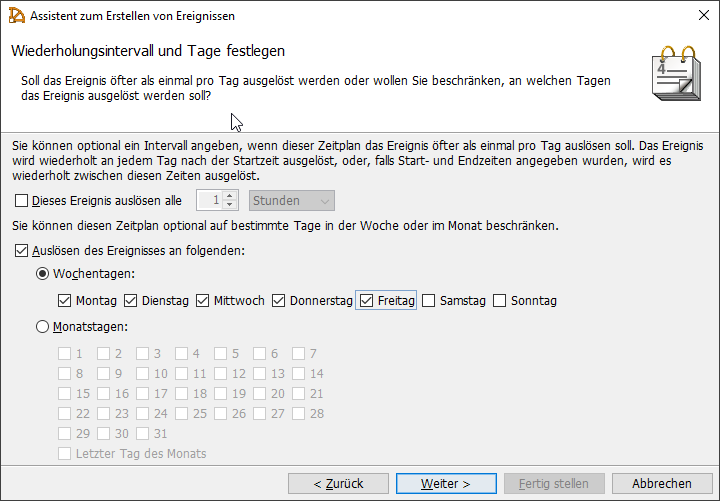

Abschließend kann man noch Optionen festlegen. Relevant ist für den Einstieg nur, dass das Ereignis *aktiviert* ist. Ansonsten wäre es definiert, würde jedoch nicht ausgelöst werden. Über dieses Kennzeichen kann man später Ereignisse in einer Datenbank "geparkt" anlegen und nur bei Bedarf aktivieren.

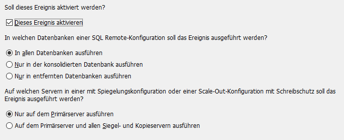

Ich definiere auch bei Ereignissen immer gerne einen Kommentar. Dieser hilft mir und anderen technischen Nutzern später, zu erklären, was das Ereignis macht und in welcher Konstellation es ausgeführt wird.

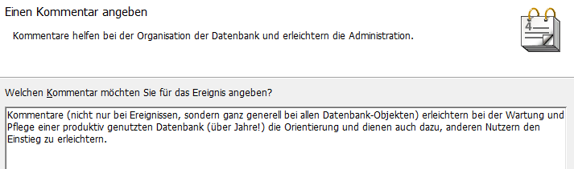

Abschließend wird die Zusammenfassung angezeigt. Das interessante ist: es handelt sich dabei um SQL-Statements - und zwar genau die, die im Hintergrund dann auch tatsächlich auf der Datenbank ausgeführt werden, um das Ereignis anzulegen.

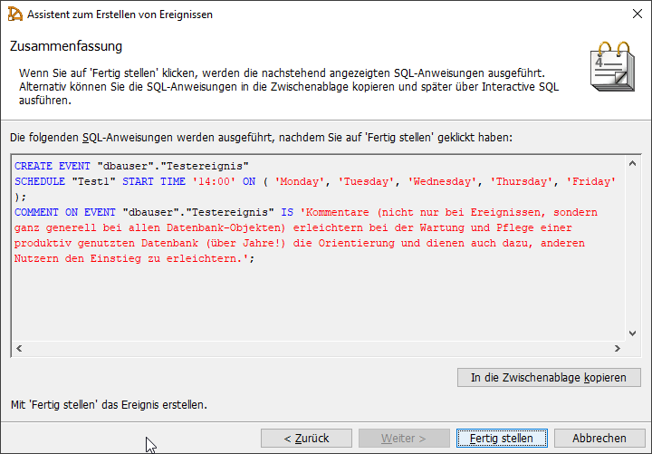

Wer möchte, kann sich das SQL-Statement wegkopieren, um später von Hand per SQL direkt ein Ereignis anzulegen. Das geht im Allgemeinen per SQL schneller als über den Assistenten.

```sql
CREATE EVENT "dbauser"."Testereignis"
SCHEDULE "Test1" START TIME '14:00' ON ( 'Monday', 'Tuesday', 'Wednesday', 'Thursday', 'Friday' );
COMMENT ON EVENT "dbauser"."Testereignis" IS 'Kommentare (nicht nur bei Ereignissen, sondern ganz generell bei allen Datenbank-Objekten) erleichtern bei der Wartung und Pflege einer produktiv genutzten Datenbank (über Jahre!) die Orientierung und dienen auch dazu, anderen Nutzern den Einstieg zu erleichtern.';
```

Das Ereignis ist jetzt angelegt und es wird auch gestartet werden, aber es macht noch nichts - es ist ja noch kein "Inhalt" definiert worden. Nach dem Schließen des Assistenten kann man das im Reiter *SQL* machen. Zwischen `BEGIN` und `END` können eine oder mehrere SQL-Statements eingegeben werden.

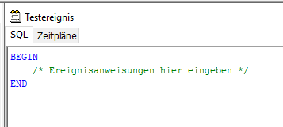

### Tabelle anlegen

Jetzt haben wir aber ein Problem: unsere Datenbank ist ja bis auf das Testereignis komplett leer. Wir haben noch nicht einmal eine einzige Tabelle, in die unser Ereignis etwas hineinschreiben könnte. Also, legen wir schnell eine Tabelle an. Damit es wirklich schnell geht, starten wir direkt aus dem SQL Central über das Kontextmenü den [iSQL](../isql/). Dazu auf dem Datenbank-Knote mit der rechten Maustaste das Kontextmenü aufrufen und direkt den ersten Punkt *Interactive SQL öffnen* wählen. Es startet jetzt der iSQL und ist sofort mit unserer aktuellen Datenbank verbunden.

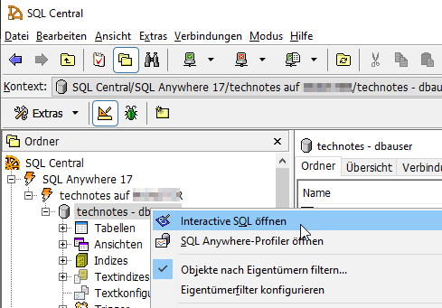

Wir geben folgendes Snippet ein, um eine Tabelle anzulegen:

```sql
CREATE TABLE testtabelle (
  id INTEGER DEFAULT AUTOINCREMENT,
  wert VARCHAR(30) NOT NULL,
  angelegt_ts DATETIME DEFAULT CURRENT TIMESTAMP,
  PRIMARY KEY (id)
);
```

Nach einem Druck auf **F9** ist die Tabelle angelegt worden. Zurück im SQL Central klappen wir den Knoten *Tabellen* auf und können die Tabelle direkt auswählen. Rechts werden uns auf dem Reiter *Spalten* die drei Spalten angezeigt:

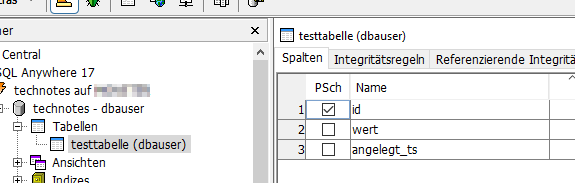

Unsere Tabelle hat drei Spalten:

- die Spalte ID ist der Primärschlüssel und wird von der Datenbank automatisch vergeben
- die Spalte ANGELEGT_TS ist ein Zeitstempel und wird ebenfalls von der Datenbank vergeben - es wird immer der beim Anlegen eines Datensatzes aktuelle Zeitstempel eingetragen
- die Spalte WERT dient dazu, dass wir beim Anlegen eines Datensatzes überhaupt etwas erfassen können; das ist das Feld, in das unser Ereignis hineinschreiben soll

### einen Datensatz anlegen

Wir testen das einmal von Hand, in dem wir über den iSQL folgendes SQL ausführen:

```sql
INSERT INTO testtabelle (wert)
VALUES ('erster Datensatz');
```

Wenn wir im SQL Central auf der Tabelle auf den Reiter *Daten* (ganz rechts) wechseln, sehen wir den neu angelegten Datensatz. Die ID ist wie erwartet "1", der WERT = "erster Datensatz" und der Zeitstempel wurde auch auf den aktuellen Zeitpunkt gesetzt:

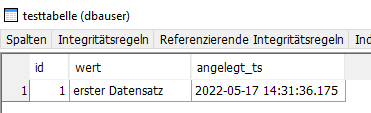

### Event soll Datensätze anlegen

Jetzt können wir unseren Event anpassen. Wir wechseln auf das *Testereignis* und tragen unser gerade getestetes SQL-Statement dort ein. Damit man den Unterschied sieht, habe ich den Text für das WERT-Feld entsprechend angepasst.


Damit unser Event sinnvoll getestet werden kann, müssen wir den Zeitplan anpassen. Wir erinnern uns: bislang startet das Ereignis nur einmal am Tag und dieser Zeitpunkt ist leider schon vorbei. Wir wechseln im Ereignis auf den Reiter *Zeitpläne* und öffnen per Doppelklick den Zeitplan *Test1*. Wir können die allgemeine Startbedingung so lassen und wechseln auf den zweiten Reiter *Wiederholung*. Hier definieren wir, dass sich die Auslösung des Ereignisses **alle 5 Minuten** wiederholen soll.

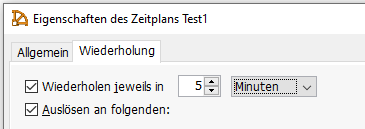

!!! note "Hinweis"

    In einer Crontab-Datei entspricht das folgendem Eintrag:
    `*/5 * * * *`

Wenn wir wieder direkt auf den Knoten *Ereignisse* wechseln, sehen wir rechts, das das Testereignis aktiviert und eingeplant ist. Der *nächste Auslösezeitpunkt* ist in wenigen Minuten - jetzt gilt es abzuwarten.

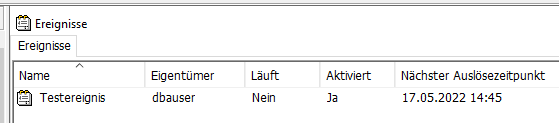

Wenn wir nach einigen Minuten die Ansicht mit `F5` aktualisieren, sehen wir, dass der nächste Auslösezeitpunkt um 5 Minuten weitergewandert ist. Unser Event ist somit einmal gestartet worden.

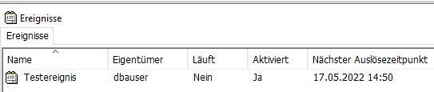

### Tabelle abfragen

Über den iSQL lässt sich am leichtesten die Tabelle abfragen:

```sql
SELECT * FROM testtabelle
```

| id | wert                   | angelegt_ts             |
| -: | ---------------------- | ----------------------- |
|  1 | erster Datensatz       | 2022-05-17 14:31:36.175 |
|  2 | Datensatz aus Ereignis | 2022-05-17 14:40:00.009 |
|  3 | Datensatz aus Ereignis | 2022-05-17 14:45:00.014 |

Zusätzlich zu unserem ersten Datensatz haben wir hier jetzt zwei weitere Datensätze, die durch das Ereignis angelegt worden sind. Anhand des Zeitstempels sehen wir, dass SQL Anywhere ziemlich pünktlich ist, wass das Starten von eingeplanten Ereignissen angeht.

### Ereignis deaktivieren

Damit unsere Datenbank nicht alle 5 Minuten einen neuen Datensatz in unserer Testtabelle anlegt, deaktivieren wir das Ereignis. Über das Kontextmenü direkt auf dem Eintrag *Testereignis* im Datenbank-Baum entfernen wir das Häkchen bei *Aktiviert*.

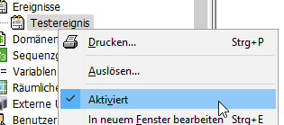

Man kann das deaktivierte Ereignis später im Datenbank-Baum an einem kleinen roten Fleck am Icon erkennen:

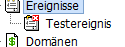

## Nächste Schritte

- Ereignisse anlegen, die über eine Systembedingung gestartet werden
- manuelle Ereignisse anlegen und programmatisch auslösen


{{ feedback(page.meta.title, page.meta.section, page.meta.slug) }}

