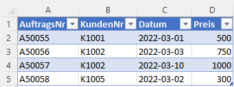
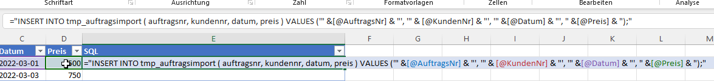
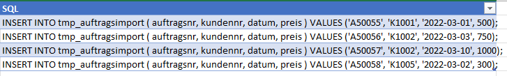
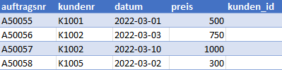
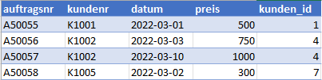

# Import von Excel-Daten in eine Datenbank

## Hintergrund

Regelmäßig muss ich für Kunden Daten in Datenbanken importieren. Dabei handelt es sich um Datenstrukturen, wofür die jeweiligen Frontend-Programme keine fertigen Importfunktionen besitzen. Die Daten befinden sich meist in manuell gepflegten oder überarbeiteten Excel-Tabellen.

Nachfolgend beschreibe ich meinen typischen Workflow beim Import von Excel-Daten in eine SQL-Datenbank. Augenmerk lege ich dabei vor allem auf die häufige Konstellation, dass die Importdaten "sprechende Nutzschlüssel" besitzen (z.B. Kundennummern), beim Import jedoch die "technischen" Primärschlüssel verwendet werden müssen.

## Vorgehen

- Importtabelle anlegen
- SQL-Importstatements in Excel-Tabelle anlegen
- SQL-Statements kopieren und ggf. in Editor nachbearbeiten
- per SQL-Client in die Importtabelle importieren
- dort ggf. nachbearbeiten und in die richtigen Tabellen schreiben

### 1. Importtabelle

Beim Import von Daten aus einer Excel-Tabelle kann es sein, dass in der Datei *sprechende Schlüssel* (z.B. Kundennummern in Aufträgen) verwendet werden. Beim Import in die relationale Datenbank müssen diese dann in die tatsächlichen Fremdschlüssel umgesetzt werden.

Für diesen Zweck gehe ich so vor, dass ich eine **separate Tabelle nur für den Importvorgang** anlege. In diese werden dann die Excel-Daten (mit den sprechenden Schlüsseln) importiert. Anschließend werden anhand der sprechenden Schlüssel die Fremdschlüssel (also die Primärschlüssel der referenzierten Tabelle) eingelesen. Der finale Import (sh. Punkt 6) kann dann mit den richtigen Fremdschlüsseln erfolgen.

In diesem Beispiel beschreibe ich den Import von Auftragsdaten. Die Importdaten beinhalten die Kundennummer. Tatsächlich muss in die endgültige Auftragstabelle jedoch der Primärschlüssel aus der Kundentabelle geschrieben werden.

Die Importtabelle heißt `tmp_auftragsimport`. Sie hat die vier Spalten, die auch in der Excel-Tabelle vorkommen. Zusätzlich gibt es eine Spalte `kunden_id`. In diese wird später anhand der Kundennummer der Primärschlüssel aus der Kundentabelle geschrieben.

```sql
CREATE TABLE tmp_auftragsimport (
  auftragsnr TEXT,
  kundennr   TEXT,
  datum      DATE,
  preis      NUMERIC(10,2),
  kunden_id  INTEGER
);
```

### 2. SQL-Importstatements in Excel-Tabelle anlegen

Beispiel-Excel-Tabelle:



In der Excel-Tabelle lege ich eine neue Spalte an (oft mit dem Namen **SQL**). Hier baue ich dynamisch das SQL-Importstatement als Excel-Formel zusammen, indem ich die variablen Werte aus den entsprechenden Spalten lese:



```
="INSERT INTO tmp_auftragsimport ( auftragsnr, kundennr, datum, preis )
VALUES ('" &[@AuftragsNr] & "', '" & [@KundenNr] & "', '" & TEXT([@Datum];"JJJJ-MM-TT") & "', " &[@Preis] & ");"
```

Nach der Autovervollständigung (in neueren Excel-Versionen) finden sich folgende Texte in der SQL-Spalte:




### 3. SQL-Statements nachbearbeiten

Der Inhalt der Spalte **SQL** kann dann in einem [geeigneten Texteditor](/misc/texteditor/) nachbearbeitet werden:

```sql
DELETE FROM tmp_auftragsimport;

INSERT INTO tmp_auftragsimport ( auftragsnr, kundennr, datum, preis ) VALUES ('A50055', 'K1001', '2022-03-01', 500);
INSERT INTO tmp_auftragsimport ( auftragsnr, kundennr, datum, preis ) VALUES ('A50056', 'K1002', '2022-03-03', 750);
INSERT INTO tmp_auftragsimport ( auftragsnr, kundennr, datum, preis ) VALUES ('A50057', 'K1002', '2022-03-10', 1000);
INSERT INTO tmp_auftragsimport ( auftragsnr, kundennr, datum, preis ) VALUES ('A50058', 'K1005', '2022-03-02', 300);


COMMIT;
```

Im Beispiel gehe ich davon aus, dass ich diesen Import nicht zum ersten Mal mache und deshalb evtl. bereits Datensätze in der Importtabelle stehen. Diese lösche ich zuerst. Anschließend werden die Datensätze importiert. Am Ende des Skripts wird sicherheitshalber ein `COMMIT` ausgeführt, um die importierten Daten festzuschreiben.

### 4. per SQL-Client importieren

Über den bordeigenen SQL-Client der jeweils genutzten Datenbank (z.B. den [iSQL bei SQL Anywhere](/sql-anywhere/isql/)) werden die Statements an die Datenbank gesendet. In der dort bereits angelegten Importtabelle entstehen entsprechend die Datensätze. Diese sehen aus wie in der ursprünglichen Excel-Tabelle. Zusätzlich gibt es das o.g. Feld `kunden_id`, das noch leer ist.



### 5. Daten in Importtabelle nachbearbeiten

Vor dem finalen Import muss jetzt das Feld `kunden_id` mit den richtigen Daten befüllt werden. Wir wissen, dass in unserer Kundentabelle das Primärschlüsselfeld `ID` heißt und die Kundentabelle ein Feld für die Kundennummer hat. Anhand der Kundennummer aus der Importtabelle und der Kundennummer in der Kundentabelle verknüpfen wir beide Tabellen, lesen die *ID* des Kunden aus und schreiben diese in die Importtabelle.

```sql
UPDATE  tmp_auftragsimport
SET     kunden_id = k.id
FROM    tmp_auftragsimport AS tmp
        INNER JOIN
        kundentabelle AS k
        ON k.kundennr = tmp.kundennr;
```

Die Datensätze in der Importtabelle sehen danach so aus:



### 6. Finaler Import

Anschließend können die Importdatensätze in die richtige Auftragstabelle importiert werden. Die Kunden*nummer* fällt dabei unter den Tisch - nur die Kunden-*ID* wird verwendet.

```sql
INSERT INTO auftragstabelle (kunden_id, auftragsnr, datum, preis)
SELECT  kunden_id, auftragsnr, datum, preis
FROM    tmp_auftragsimport;
```

## Variante mit direktem Import

Bei einer so einfach Datenkonstellation könnte man auf die Anreicherung der Kunden-ID in der Importtabelle verzichten und diese direkt beim finalen Import ermitteln:

```sql
INSERT INTO auftragstabelle (kunden_id, auftragsnr, datum, preis)
SELECT  k.id, tmp.auftragsnr, tmp.datum, tmp.preis
FROM    tmp_auftragsimport AS tmp
        INNER JOIN
        kundentabelle AS k
        ON k.kundennr = tmp.kundennr;
```


## Variante mit Trigger

Für Importvorgänge, die ich immer wieder vornehmen muss, spare ich mir den 5. Schritt mit der manuellen Anreicherung der Kunden-ID. Statt dessen lege ich auf die Importtabelle einen [Trigger](../datenbank-trigger), der bei jedem neuen Datensatz die Kunden-ID ermittelt und in die Spalte schreibt.

*Hinweis*: das Beispiel verwendet PostgreSQL-Syntax. PostgreSQL trennt zwischen dem Trigger und der Trigger-Funktion!

```sql
CREATE TABLE tmp_auftragsimport (
  auftragsnr TEXT,
  kundennr   TEXT,
  datum      DATE,
  preis      NUMERIC(10,2),
  kunden_id  INTEGER
);

CREATE OR REPLACE FUNCTION trg_auftragsimport_hole_kundenid()
RETURNS trigger
LANGUAGE plpgsql AS
$BODY$
BEGIN
  
  NEW.kunden_id = (SELECT id FROM kundentabelle WHERE kundennr = NEW.kundennr);

  RETURN NEW;
END;
$BODY$;

CREATE TRIGGER tib_auftragsimport_hole_kundenid
  BEFORE INSERT
  ON tmp_auftragsimport
  FOR EACH ROW
  EXECUTE PROCEDURE trg_auftragsimport_hole_kundenid();
```
